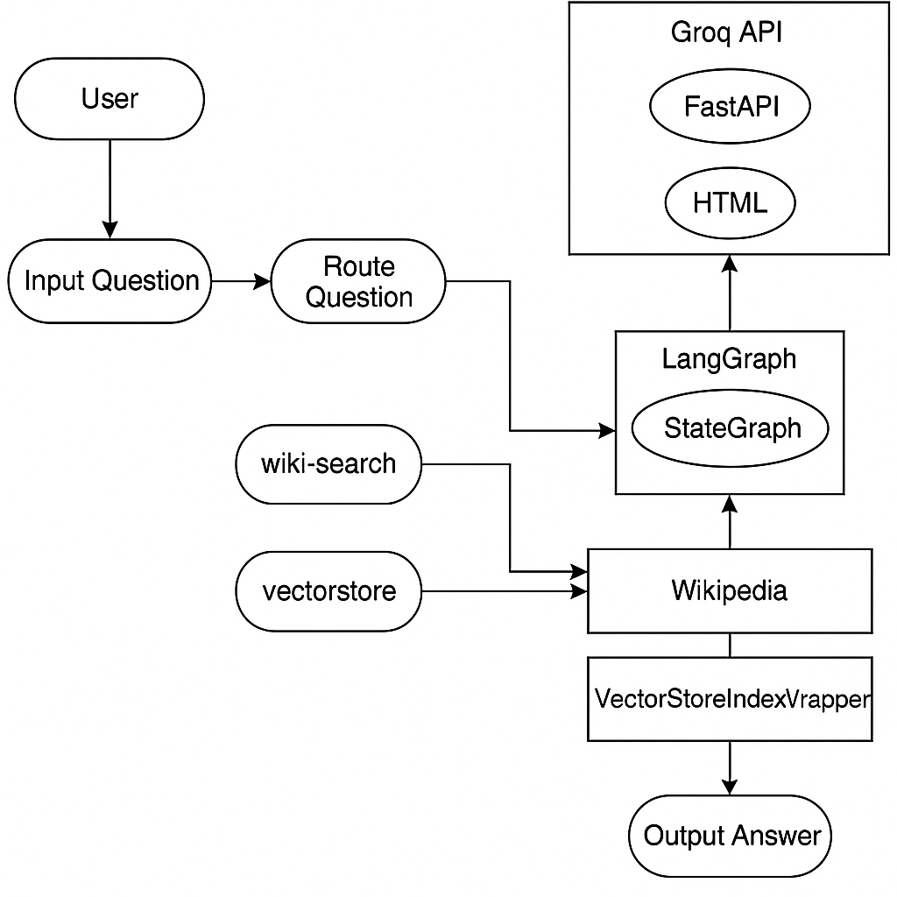
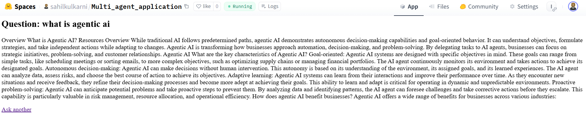

# Lang Graph Multi-Agent AI Application

A full-stack Retrieval-Augmented Generation (RAG) Chatbot using LangGraph, AstraDB Vector Database, LLaMA-3 via Groq API, and FastAPI backend with a custom HTML/JS frontend. Deployed via Docker on Hugging Face Spaces.

---

## Project Architecture




---

## Folder Structure

```
📦project-root
├── Dockerfile
├── requirements.txt
├── app.py
├── static
│   ├── index.html
│   └── script.js
└── README.md
```
## Huggingface Run


Link : [](https://<your-username>.hf.space)




---

## How It Works

### 1. **Frontend (HTML/JS)**

* Simple HTML form for user input.
* JavaScript sends POST request to `/ask` endpoint.
* Receives and displays response dynamically.

### 2. **FastAPI Backend**

* `GET /` : Serves HTML interface.
* `POST /ask` : Handles form submission, triggers LangGraph workflow.

### 3. **LangGraph Workflow Execution**

* Uses LangGraph's `StateGraph` to manage orchestration.
* Router LLM (via Groq API) decides whether to search VectorStore or Wikipedia.
* Executes retrieval process accordingly.

### 4. **VectorStore Search (AstraDB)**

* Loads domain-specific documents.
* Splits them using token-based chunking.
* Embeds and stores in AstraDB.
* Retrieves most relevant chunks for given queries.

### 5. **Wikipedia Tool Search**

* Utilizes LangChain's Wikipedia API Wrapper.
* Returns top Wikipedia snippet if query is outside VectorStore domain.

### 6. **LLM Response Generation**

* Retrieved documents are fed into LLaMA-3 model via Groq API.
* Generates the final response to be sent back to the frontend.

### 7. **Response Display on Frontend**

* The final answer is streamed back and rendered in the browser UI.

---

## Deployment Steps

### 1. Clone Repository

```bash
git clone https://github.com/your-username/langgraph-multiagent-rag-bot.git
cd langgraph-multiagent-rag-bot
```

### 2. Set Hugging Face Space Secrets

* `ASTRA_DB_TOKEN`
* `ASTRA_DB_ID`
* `GROQ_API_KEY`
* `HUGGINGFACEHUB_API_TOKEN`

### 3. Push to Hugging Face Spaces

```bash
git add .
git commit -m "Deploy LangGraph Multi-Agent Bot"
git push origin main
```

---

## Dockerfile Overview

```Dockerfile
FROM python:3.10-slim

WORKDIR /app

RUN apt-get update && apt-get install -y build-essential curl git && rm -rf /var/lib/apt/lists/*

COPY requirements.txt ./
COPY app.py ./
COPY static ./static

RUN pip install --no-cache-dir -r requirements.txt

EXPOSE 7860

CMD ["uvicorn", "app:app", "--host", "0.0.0.0", "--port", "7860"]
```

---

## Example Usage

1. Visit the deployed Hugging Face Space.
2. Enter a question like "What is Agentic AI?"
3. The system will route the query and return an answer from VectorStore or Wikipedia.

---

## Tech Stack Summary

| Component     | Technology                         |
| ------------- | ---------------------------------- |
| Backend       | FastAPI                            |
| Frontend      | HTML + JavaScript                  |
| Vector DB     | AstraDB (Cassio integration)       |
| Orchestration | LangGraph                          |
| LLM Router    | LLaMA-3 via Groq API               |
| Embeddings    | Hugging Face Sentence Transformers |
| Deployment    | Hugging Face Spaces (Docker)       |

---

## Credits

* [LangGraph](https://github.com/langchain-ai/langgraph)
* [LangChain](https://github.com/langchain-ai/langchain)
* [Groq API](https://console.groq.com/)
* [Hugging Face Spaces](https://huggingface.co/spaces)

---

## License

MIT License
